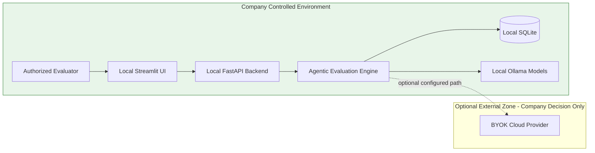
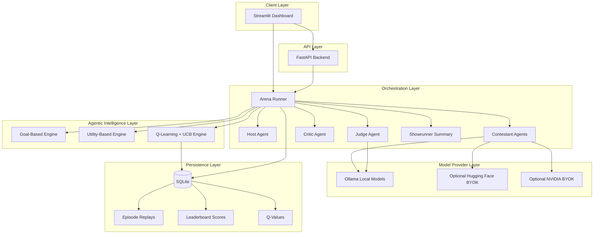
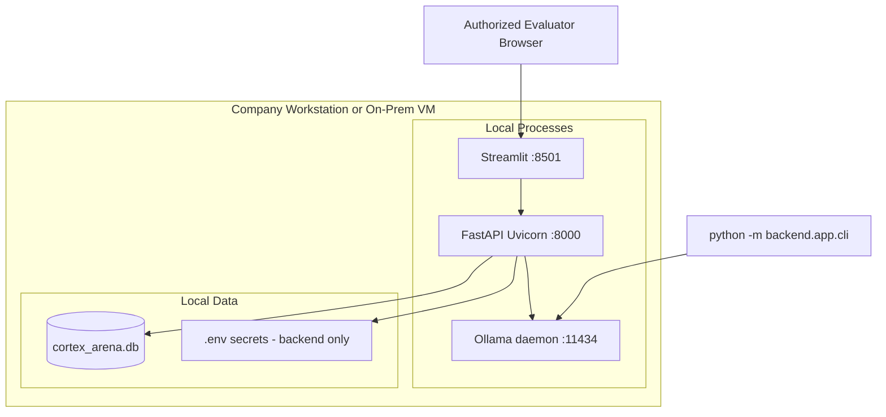
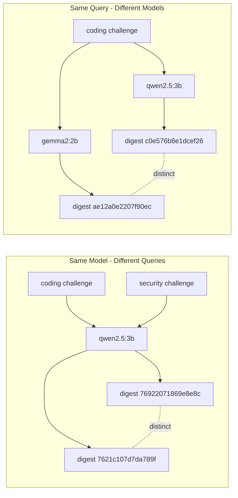
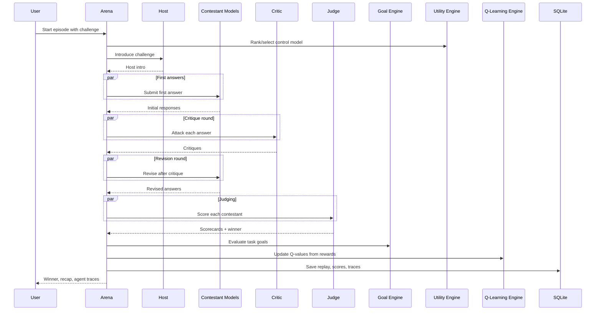
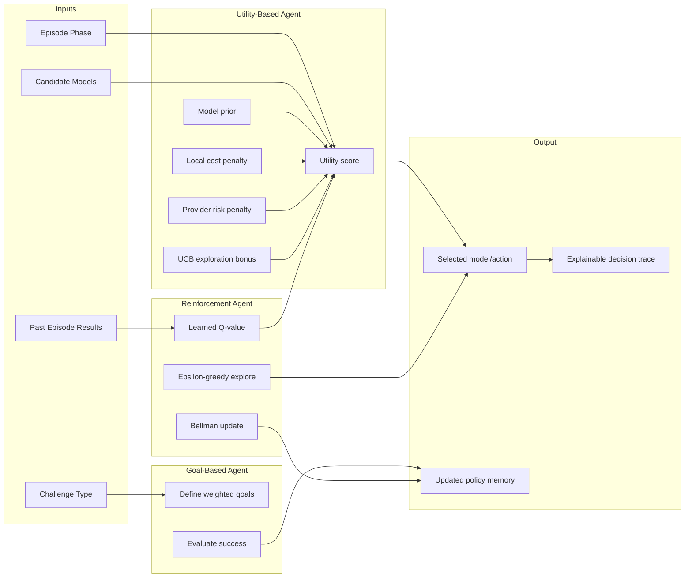
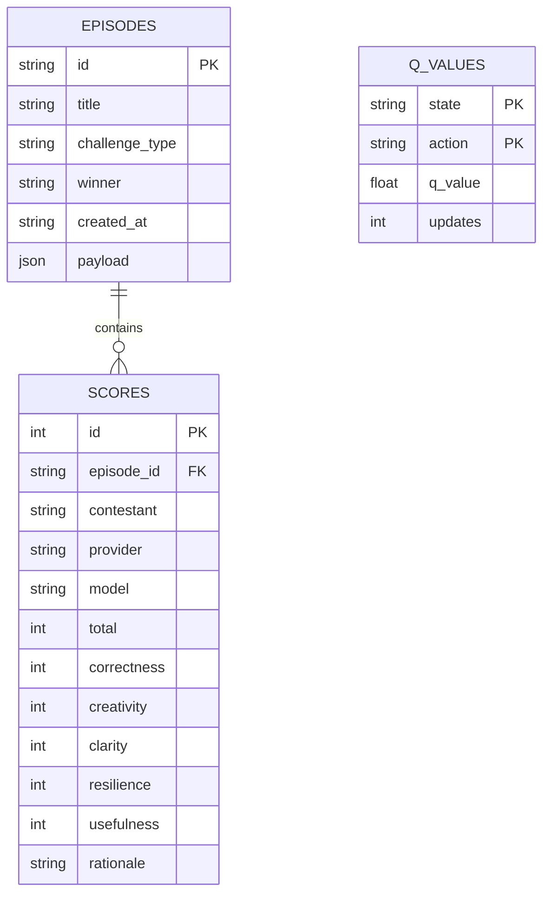
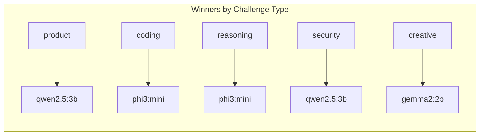

# Cortex Arena

[](https://github.com/Sarthak6o1/cortex-arena)

**A local-first agentic AI evaluation platform for company model testing, private prompt benchmarking, and HIPAA-aligned on-premise workflows.**

Repository: [github.com/Sarthak6o1/cortex-arena](https://github.com/Sarthak6o1/cortex-arena)

**New here?** Start with the step-by-step local guide: [`docs/GETTING_STARTED.md`](docs/GETTING_STARTED.md)

### Run locally in 5 commands

```bash
git clone https://github.com/Sarthak6o1/cortex-arena.git
cd cortex-arena
python -m venv .venv && .venv\Scripts\activate    # Windows
# source .venv/bin/activate                       # macOS/Linux
pip install -e . && pip install -e .[dev]
python -m backend.app.cli --pull-recommended
python -m streamlit run frontend/streamlit_app.py
```

Then open [http://localhost:8501](http://localhost:8501). Full setup, troubleshooting, and automated checks are in [`docs/GETTING_STARTED.md`](docs/GETTING_STARTED.md).

Cortex Arena helps teams evaluate large language models on their own hardware without sending prompts, scores, or replay history to a hosted AI service by default. Local Ollama models compete in structured episodes, receive critique, revise their answers, get scored by judge agents, and build long-term selection memory through goal-based reasoning, utility-based decisions, Q-learning, and UCB exploration.

Designed for **company-local evaluation**, **internal AI labs**, and **privacy-sensitive environments** where data residency, auditability, and controlled model selection matter.

> **Important:** Cortex Arena is designed with a **HIPAA-aligned local posture**. It is **not** a certified HIPAA product, medical device, or compliance guarantee by itself. Your organization remains responsible for policies, access control, encryption, retention, BAAs, and approved deployment practices.

---

## Table of Contents

- [Major Use Case](#major-use-case)
- [Company Evaluation and HIPAA-Aligned Design](#company-evaluation-and-hipaa-aligned-design)
- [Why This Project Exists](#why-this-project-exists)
- [System Architecture](#system-architecture)
- [Episode Flow](#episode-flow)
- [Agentic Decision Stack](#agentic-decision-stack)
- [Data and Memory Layer](#data-and-memory-layer)
- [Features](#features)
- [Tech Stack](#tech-stack)
- [Quickstart](#quickstart)
- [Run on Your Machine (Full Guide)](#run-on-your-machine-full-guide)
- [Verify Everything Works](#verify-everything-works)
- [Live Verification Results](#live-verification-results)
- [Model Benchmark Results](#model-benchmark-results)
- [Deployment Topology](#deployment-topology)
- [Query Differentiation Flow](#query-differentiation-flow)
- [API Endpoints](#api-endpoints)
- [Mathematical Core](#mathematical-core)
- [Project Structure](#project-structure)
- [Security Model](#security-model)
- [Roadmap](#roadmap)
- [License and Contribution](#license-and-contribution)

---

## Major Use Case

Cortex Arena is built for **company-local LLM evaluation** in environments where teams need evidence-backed model selection without exposing internal prompts to public cloud APIs.

Use it when you want to:

- compare local models on the same internal prompt, workflow, or policy task
- benchmark agentic behavior instead of one-shot chat responses
- decide which model to use for coding, security, product, clinical ops support, or reasoning work
- keep prompts, scores, critiques, and replay history on company-controlled hardware
- run evaluation episodes before approving a model for internal production use
- experiment with mathematical agent selection policies in a private lab setting

**In one line:** a private on-premise arena where local LLMs compete, improve, get judged, and leave an auditable trace.

---

## Company Evaluation and HIPAA-Aligned Design

Cortex Arena is intended for organizations that need **local evaluation** of AI models in privacy-sensitive contexts, including healthcare-adjacent, HR, finance, legal, and internal operations workflows.

### What "HIPAA-aligned local design" means here

This project supports a **local-first privacy posture** that aligns with common HIPAA technical safeguard goals, such as:

| Safeguard goal | How Cortex Arena supports it |
|----------------|--------------------------------|
| **Minimum necessary exposure** | Default Ollama mode keeps prompts and outputs on the local machine |
| **Data residency** | Episode replays, scores, Q-values, and leaderboards stay in local SQLite |
| **No maintainer cloud dependency** | The repo does not ship shared API keys or force hosted inference |
| **Controlled optional egress** | Cloud providers are disabled unless the company explicitly configures BYOK |
| **Auditability** | Episodes store host intros, answers, critiques, revisions, scores, and decision traces |
| **Explainability** | Goal, utility, and reinforcement traces show why a model was selected or rewarded |
| **Separation of duties** | Backend reads secrets from `.env`; frontend never receives API key values |

### Trust boundary diagram



### Recommended company deployment model

For privacy-sensitive evaluation, deploy Cortex Arena as an **internal local lab**:

1. Install on a company-managed laptop, workstation, or on-premise VM
2. Use **Ollama-only mode** for evaluation of sensitive prompts
3. Store SQLite data on encrypted company storage
4. Restrict access to authorized evaluators only
5. Disable optional cloud providers unless legal/security approves them
6. Use synthetic, de-identified, or approved test prompts during model selection
7. Keep production PHI out of experimental episodes unless explicitly approved by policy

### What this platform is good for in a company

- selecting the best local model for internal copilots
- comparing model quality on approved non-production test cases
- testing agentic workflows before rollout to staff-facing tools
- building an internal leaderboard of model performance by task type
- documenting why one model was chosen over another

### What this platform does not replace

Cortex Arena does **not** by itself provide:

- HIPAA certification
- a Business Associate Agreement (BAA)
- enterprise IAM / SSO
- centralized audit log shipping
- automatic PHI de-identification
- legal or compliance sign-off

Those remain organizational responsibilities. This project gives you a **local evaluation framework** that supports privacy-conscious deployment patterns.

### Suggested GitHub positioning

**Repo name:** `cortex-arena`

**Short description:**

> Local-first agentic AI evaluation platform for company model testing, private prompt benchmarking, and HIPAA-aligned on-premise LLM comparison with replayable audit traces.

**Detailed description:**

> Cortex Arena is an on-premise agentic AI lab for organizations that need to compare, critique, score, and learn from local LLMs without sending evaluation data to hosted services by default. It supports company-local model selection, explainable agent decisions, SQLite replay history, and optional bring-your-own-key cloud providers for teams operating under privacy-sensitive and HIPAA-aligned workflows.

---

## Why This Project Exists

Most local LLM demos are simple chatbots. Cortex Arena goes further:

| Typical chatbot demo | Cortex Arena |
|----------------------|----------------|
| One prompt, one answer | Multi-round agent workflow |
| No comparison | Side-by-side model competition |
| No memory | Q-table + leaderboard + replays |
| No reasoning trace | Goal, utility, and policy decisions saved |
| Cloud dependent | Ollama-first, offline after model download |

This makes the project useful for GitHub showcases, internal AI labs, model selection research, and agentic AI experimentation.

---

## System Architecture

High-level view of the full platform:



---

## Deployment Topology

How Cortex Arena typically runs on a company-managed machine:



Default mode keeps prompts, model outputs, scores, and replay history on the host. Optional cloud providers are off unless `.env` is configured.

---

## Query Differentiation Flow

Each challenge and model pair produces a distinct contestant answer. The verification script hashes outputs to prove they are not identical:



---

## Episode Flow

What happens when you run one episode:



---

## Agentic Decision Stack

How the app chooses and learns from models:



---

## Data and Memory Layer

What gets stored locally after each episode:



Stored concepts:

| Concept | Meaning |
|---------|---------|
| `state` | `challenge_type:phase` such as `coding:judge` |
| `action` | `provider:model` such as `ollama:qwen2.5:3b` |
| Episode payload | Full replay: answers, critiques, revisions, goals, decisions |
| Leaderboard | Aggregated score history per model |
| Q-table | Learned model preference memory |

---

## Features

- **Local-first execution** with Ollama and no required API keys
- **Multi-agent episodes** with host, contestants, critic, judge, and recap agents
- **Mixed challenge types**: coding, reasoning, research, creative, security, product
- **Goal-based evaluation** of whether an episode met its objectives
- **Utility-based model ranking** with explainable scoring
- **Q-learning memory** that improves model selection over time
- **UCB exploration** for under-tested models
- **Replay history** and season leaderboard in SQLite
- **Streamlit dashboard** for setup, episodes, agent traces, and analytics
- **FastAPI backend** for programmatic access
- **Unit tests** for math, storage, and agent logic

---

## Tech Stack

| Layer | Technology |
|-------|------------|
| Language | Python 3.10+ |
| API | FastAPI + Uvicorn |
| UI | Streamlit |
| Models | Ollama (default), optional Hugging Face / NVIDIA BYOK |
| Storage | SQLite |
| Validation | Pydantic |
| HTTP client | httpx |
| Tests | pytest |

Recommended local models:

- `llama3.2:3b`
- `qwen2.5:3b`
- `phi3:mini`
- `gemma2:2b`

---

## Quickstart

### 1. Install Ollama

Download from [ollama.com](https://ollama.com).

### 2. Install the project

```bash
git clone https://github.com/Sarthak6o1/cortex-arena.git
cd cortex-arena

python -m venv .venv
.venv\Scripts\activate        # Windows
# source .venv/bin/activate   # macOS/Linux

pip install -e .
pip install -e .[dev]
```

### 3. Check setup

```bash
python -m backend.app.cli
```

Expected:

```text
Ollama running: True
Recommended free models:
  - llama3.2:3b [installed]
  - qwen2.5:3b [installed]
  ...
```

### 4. Pull recommended models

```bash
python -m backend.app.cli --pull-recommended
```

Or manually:

```bash
ollama pull llama3.2:3b
ollama pull qwen2.5:3b
ollama pull phi3:mini
ollama pull gemma2:2b
```

### 5. Run the dashboard

```bash
python -m streamlit run frontend/streamlit_app.py
```

Open: [http://localhost:8501](http://localhost:8501)

### 6. Optional API server

```bash
uvicorn backend.app.main:app --reload
```

Open: [http://127.0.0.1:8000/docs](http://127.0.0.1:8000/docs)

---

## Run on Your Machine (Full Guide)

For a complete walkthrough with prerequisites, Windows/macOS/Linux commands, troubleshooting, and automated verification scripts, see:

**[`docs/GETTING_STARTED.md`](docs/GETTING_STARTED.md)**

That guide covers:

| Step | Command / action |
|------|------------------|
| Install Ollama | [ollama.com](https://ollama.com) |
| Clone repo | `git clone https://github.com/Sarthak6o1/cortex-arena.git` |
| Install deps | `pip install -e . && pip install -e .[dev]` |
| Pull models | `python -m backend.app.cli --pull-recommended` |
| Run UI | `python -m streamlit run frontend/streamlit_app.py` |
| Unit tests | `pytest -v` |
| Output check | `python scripts/verify_live_behavior.py` |
| Winner benchmark | `python scripts/run_model_benchmark.py` |

The benchmark runs five challenge types (product, coding, reasoning, security, creative) and writes scored results to [`docs/benchmark_results.json`](docs/benchmark_results.json). Expect **15–30 minutes** on a typical laptop.

---

## Verify Everything Works

### Level 1: Infrastructure

```bash
python -m backend.app.cli
```

You should see `Ollama running: True` and installed models.

### Level 2: Core logic

```bash
pytest -v
```

Expected: all tests pass.

Current test coverage:

| Test | Validates |
|------|-----------|
| Q-learning update | Bellman rule and SQLite Q-value persistence |
| Utility engine | Higher-Q model is selected |
| Goal engine | Strong episodes mark goals as met |
| Episode store | Replay, leaderboard, and Q-table persistence |

### Level 3: Full end-to-end episode

1. Open the Streamlit app
2. Go to **Run Episode**
3. Select 2 or more contestant models
4. Enable goal, utility, and reinforcement engines
5. Start an episode
6. Confirm you see:
   - host intro
   - first answers
   - critiques
   - revised answers
   - scorecards
   - winner
   - Q-learning updates
   - saved replay

If all of that appears, the app is working end-to-end.

### Level 4: Live query and model differentiation

```bash
python scripts/verify_live_behavior.py
```

Checks that different prompts and different models produce different raw answers. Output: [`docs/verification_results.json`](docs/verification_results.json).

### Level 5: Multi-query winner benchmark

```bash
python scripts/run_model_benchmark.py
```

Runs five judged episodes (one per challenge type) with `qwen2.5:3b`, `gemma2:2b`, and `phi3:mini`. Proves that **winners change by query type**, not one model winning everything. Output: [`docs/benchmark_results.json`](docs/benchmark_results.json).

Requires Ollama with all four recommended models (`llama3.2:3b` is used as judge).

---

## Live Verification Results

Last verified: **2026-06-15T12:56:15Z** (local Ollama)

### Unit tests (`pytest -v`)

```text
4 passed in 0.25s
```

### Live behavior proof (distinct outputs)

| Test | Model(s) | Challenge types | Digest A | Digest B | Distinct? |
|------|----------|-----------------|----------|----------|-----------|
| Different queries, same model | `qwen2.5:3b` | coding vs security | `14295c103b0ca89d` | `1badab9ee5142a5c` | **Yes** |
| Same query, different models | `qwen2.5:3b` vs `gemma2:2b` | coding (same prompt) | `0d3b0d29024c0da5` | `383126a857993c77` | **Yes** |

**Overall: PASSED** — outputs are genuinely different per query and per model.

Re-run anytime:

```bash
pytest -v
python scripts/verify_live_behavior.py
python scripts/run_model_benchmark.py
```

---

## Model Benchmark Results

Last benchmark: **2026-06-15T13:16:07Z**

Judge: `llama3.2:3b` · Contestants: `qwen2.5:3b`, `gemma2:2b`, `phi3:mini` · Episodes: **5**

### Winners vary by challenge type

| Challenge | Type | Winner | Top score | Runner-up |
|-----------|------|--------|-----------|-----------|
| Secure Student Notes | product | **qwen2.5:3b** | 38 | gemma2:2b (38) |
| Bug Fix Debate | coding | **phi3:mini** | 44 | qwen2.5:3b (41) |
| Reasoning Trap | reasoning | **phi3:mini** | 39 | qwen2.5:3b (38) |
| Red Team Login | security | **qwen2.5:3b** | 38 | gemma2:2b (38) |
| Wild Startup Pitch | creative | **gemma2:2b** | 38 | phi3:mini (38) |

### Win totals

| Model | Wins | Best at (this run) |
|-------|------|---------------------|
| qwen2.5:3b | 2 | product, security |
| phi3:mini | 2 | coding, reasoning |
| gemma2:2b | 1 | creative |

**3 different winners across 5 queries** — no single model dominates every task type.

Full scored breakdown: [`docs/benchmark_results.json`](docs/benchmark_results.json)



> Results are from one local benchmark run with a small judge model. Re-run `python scripts/run_model_benchmark.py` on your hardware for your own leaderboard.

---

## API Endpoints

| Method | Endpoint | Purpose |
|--------|----------|---------|
| `GET` | `/health` | Service health check |
| `GET` | `/setup` | Ollama status and recommended models |
| `POST` | `/setup/pull/{model_id}` | Pull a recommended Ollama model |
| `GET` | `/models` | List configured provider models |
| `POST` | `/episodes` | Run a full agentic episode |
| `GET` | `/episodes` | List saved episodes |
| `GET` | `/episodes/{id}` | Fetch one replay |
| `GET` | `/leaderboard` | Season leaderboard |
| `GET` | `/reinforcement/q-table` | Learned Q-values |

---

## Mathematical Core

### Utility-based agent

```text
U(a) = 0.62*Q + 0.23*prior + exploration_bonus - cost_penalty - risk_penalty
```

Used to rank candidate models for control roles such as judge/host/critic selection.

### Hybrid Q-learning + UCB

```text
Q_UCB(a) = Q(s,a) + c * exploration_bonus
```

Used when reinforcement mode selects among previously seen actions.

### Standard Q-learning update

```text
Q(s,a) = Q(s,a) + alpha * (reward + gamma * maxQ(s_next) - Q(s,a))
```

Default policy:

| Parameter | Value | Role |
|-----------|-------|------|
| `alpha` | `0.35` | Learning rate |
| `gamma` | `0.65` | Future reward discount |
| `epsilon` | `0.12` | Random exploration rate |
| `ucb_c` | `0.18` | Exploration pressure |

Reward signals include:

- judge score
- latency penalty
- error penalty
- revision resilience

---

## Project Structure

```text
cortex-arena/
├── backend/
│   └── app/
│       ├── agentic/              Goal-based and utility-based engines
│       ├── providers/            Ollama, Hugging Face, NVIDIA adapters
│       ├── reinforcement/        Q-learning and UCB policy engine
│       ├── agents.py             Role prompts for episode agents
│       ├── arena.py              Multi-agent episode orchestration
│       ├── branding.py           App identity constants
│       ├── cli.py                Setup helper and model pull command
│       ├── config.py             Backend-only settings and secret loading
│       ├── judge.py              Score parsing and winner selection
│       ├── main.py               FastAPI entrypoint
│       ├── models.py             Pydantic schemas
│       ├── setup.py              Ollama health checks and recommended models
│       └── storage.py            SQLite replay, leaderboard, Q-table
├── frontend/
│   └── streamlit_app.py          Local dashboard
├── examples/
│   └── challenges/
│       └── mixed_challenges.json Sample challenge pack
├── tests/
│   └── test_agentic_engines.py   Unit tests for math and storage
├── scripts/
│   ├── verify_live_behavior.py   Live query/model output checks
│   └── run_model_benchmark.py    Multi-challenge winner benchmark
├── docs/
│   ├── GETTING_STARTED.md        Step-by-step local setup guide
│   ├── verification_results.json Latest output differentiation proof
│   └── benchmark_results.json    Latest multi-query winner scores
├── .env.example                  Optional BYOK provider variables
├── pyproject.toml
└── README.md
```

---

## Security Model

Cortex Arena is designed for **company-local evaluation** and a **HIPAA-aligned privacy posture**, not for exposing shared maintainer API credentials or sending evaluation data to cloud services by default.

### Default secure posture

- **Ollama-only mode** keeps inference local
- **No required API keys** for core functionality
- **Local SQLite storage** for episodes, scores, and Q-values
- **Backend-only secret loading** from `.env`
- **Frontend never receives secret values**
- **Optional cloud providers remain disabled** unless explicitly configured
- **Replayable audit traces** for answers, critiques, revisions, scores, and agent decisions

### Company controls you should add

For privacy-sensitive or healthcare-adjacent environments, organizations should also apply:

- full-disk or database encryption
- role-based access to the evaluation machine
- approved prompt datasets only
- retention and deletion policies for SQLite replay data
- network restrictions on optional cloud providers
- legal/security review before enabling BYOK inference
- separate production and evaluation environments

### Optional provider warning

If you enable Hugging Face, NVIDIA, or other hosted providers:

- prompts may leave the local trust boundary
- your company must confirm provider terms, data handling, and BAA requirements
- these paths should be treated as **non-default** and **explicitly approved**

Example local configuration:

```bash
copy .env.example .env
```

```env
HUGGINGFACE_API_KEY=
NVIDIA_API_KEY=
```

Never commit real keys.

### Compliance note

Cortex Arena helps teams adopt a **local, auditable, privacy-conscious evaluation workflow**. It does **not** automatically make your organization HIPAA compliant. Compliance depends on how you deploy, govern, and operate the system.

---

## Roadmap

### Model integrations

- LM Studio, llama.cpp server, vLLM, TGI, OpenAI-compatible local endpoints
- OpenRouter, Groq, Gemini, Together AI, Fireworks, enterprise gateways
- Company-local model registries with capability tags and benchmark history

### Mathematical improvements

- Thompson sampling and softmax/Boltzmann exploration
- Elo/Glicko-style ratings across seasons
- Multi-objective optimization for quality, latency, cost, and reliability
- Bayesian confidence intervals and Pareto frontier comparison views

### Agentic improvements

- Planner / executor / verifier chains
- Red-team / blue-team security episodes
- Tool-using agents for local files, tests, and report generation
- Long-term per-model memory
- Enterprise challenge packs for private workflows

---

## License and Contribution

This project is intended as a **company-local AI evaluation lab** for privacy-sensitive model testing, internal benchmarking, and agentic AI research.

Suggested GitHub repository description:

> Local-first agentic AI evaluation platform for company model testing, private prompt benchmarking, and HIPAA-aligned on-premise LLM comparison with replayable audit traces.

Contributions welcome in areas such as:

- new local model providers
- stronger evaluation metrics
- better mathematical selection policies
- enterprise challenge packs
- UI and reporting improvements

---

## Sample Challenge Pack

See [`examples/challenges/mixed_challenges.json`](examples/challenges/mixed_challenges.json) for starter prompts across product, coding, reasoning, security, and creative tasks.

Example:

```json
{
  "title": "Red Team Login",
  "type": "security",
  "challenge": "Review a simple email/password login design for a SaaS app. Find security risks and propose practical mitigations for a small team."
}
```

---

**Cortex Arena** — compare local models like a lab, not a chatbot. Built for company evaluation and HIPAA-aligned on-premise workflows.
